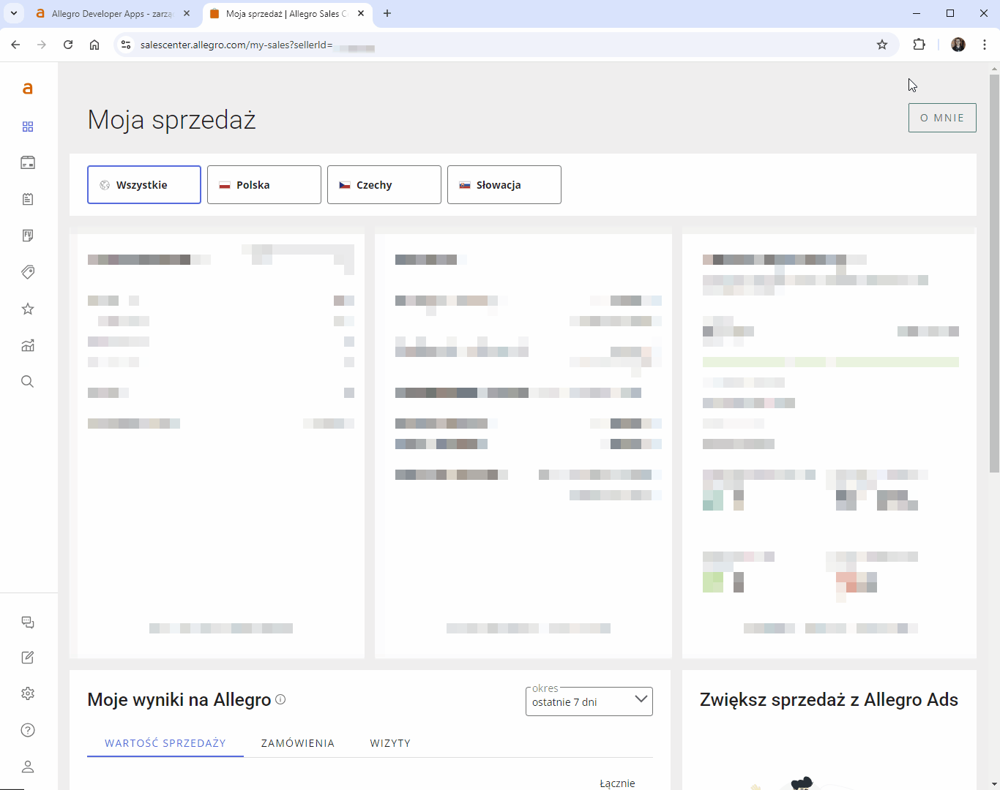
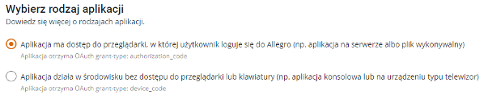
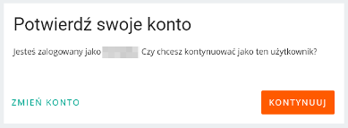
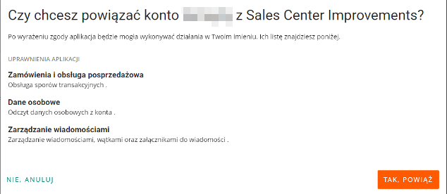

## Usprawnienia Sales Center
To rozszerzenie pozwala na wyświetlanie informacji o wiadomościach i wiadomościach w dyskusjach na stronie Sales Center, ~~czego chwilowo nie ma na tej stronie, ale ma być dodane za jakiś czas~~.

Funkcjonalność wyświetlania powiadomień o wiadomościach i wiadomościach w dyskusjach została już dodana do strony Sales Center, tak więc nie ma potrzeby korzystania z tego rozszerzenia. Jedyny sens korzystania z niego obecnie to możliwość otrzymywania powiadomień także wtedy gdy strona Sales Center nie jest otwarta.

Zostało wydane dodatkowe rozszerzenie [Usprawnienia Sales Center Lite](https://github.com/tomsyty/Sales-center-improvements-lite) które odpowiada tylko za wyświetlanie licznika wiadomości i wiadomości w dyskusjach przy ikonach w menu bocznym (obecnie wyświetlane jest to tylko przy ikonie na górnej belce), bez wyróżniania ikony podświetleniem na czerwono ani sprawdzania wiadomości w tle oraz bez konieczności rejestracji aplikacji.

Jest to rozszerzenie do przeglądarki Chrome. Wszystkie rozszerzenia testuję tylko dla systemu Windows 10 i najnowszej wersji przeglądarki.

**Instrukcja instalacji:**
1. Pobierz rozszerzenie "sales_center_improvements.zip" z listy plików widocznej powyżej i rozpakuj je tam gdzie zamierzasz je trzymać.
2. Kliknij ikonę menu rozszerzeń w prawym górnym rogu okna przeglądarki (ikona puzzla)  lub z menu przeglądarki wybierz "Rozszerzenia - Zarządzaj rozszerzeniami".
3. Włącz "Tryb dewelopera" w prawym górnym rogu okna przeglądarki 
4. Kliknij przycisk "Załaduj rozpakowane"  

5. Wybierz folder z uprzednio pobranym i rozpakowanym rozszerzeniem.
6. Po załadowaniu rozszerzenia otworzy się strona jego opcji, gdzie wymagane będzie uzupełnienie danych Client ID i Client Secret. Uzyskasz je rejestrując aplikację na stronie [apps.developer.allegro.pl](https://apps.developer.allegro.pl/)  
    

      
Instrukcja rejestracji aplikacji

      
      1. Otwórz stronę [developer.allegro.pl](https://developer.allegro.pl/).
      2. Kliknij "Zarządzaj API" - "Moje aplikacje". Upewnij się że zalogowany jesteś na konto Allegro w ramach którego działać będzie aplikacja. Jeśli nie, wyloguj się (klikając ikonę obok nazwy użytkownika i wybierz "Wyloguj") a następnie zaloguj się na właściwe konto.
      3. Kliknij przycisk "Zarejestruj aplikację".  
      4. W formularzu rejestracji aplikacji Allegro podaj następujące dane:  
        - **Nazwa aplikacji:** dowolna, np. "Sales Center Improvements"  
        - **Wybierz rodzaj aplikacji:** zaznacz pierwszą opcję ("Aplikacja ma dostęp do przeglądarki, w której użytkownik loguje się do Allegro (np. aplikacja na serwerze albo plik wykonywalny)")  
          
        - **Ścieżka aplikacji:** na stronie opcji rozszerzenia zaznacz i skopiuj tekst widniejący przy parametrze **Ścieżka aplikacji**. Jest to unikalny adres aplikacji w domenie chromiumapp.org pod który Allegro będzie przesyłać kod autoryzujący i tokeny dostępowe.  
        - **Uprawnienia aplikacji:** zaznacz następujące uprawnienia: `allegro:api:disputes` (sekcja **Zamówienia i obsługa posprzedażowa**) `allegro:api:messaging` (sekcja **Zarządzanie wiadomościami**), `allegro:api:profile:read` (sekcja **Dane osobowe**).  
        - Zaznacz `* Znam i akceptuję regulamin REST API Allegro`.  
        - Kliknij przycisk "Zarejestruj".  
        - Na koncie możesz mieć do 5 zarejestrowanych aplikacji. Jeżeli chciałbyś ją usunąć zrobisz to na tej samej stronie.
      5. Aplikacja zostanie zarejestrowana. Kliknij "Szczegóły" aby odczytać Client ID i Client Secret. Zaznacz i skopiuj parametr Client ID, wklej go na stronie opcji rozszerzenia w polu Client ID. Kliknij "Pokaż" przy parametrze Client Secret, aby odsłonić domyślnie zamaskowaną wartość tego parametru, zaznacz i skopiuj parametr Client Secret, wklej go na stronie opcji rozszerzenia w polu Client Secret. Zamknij okno ze szczegółami aplikacji.
      6. Kliknij "Zapisz" a następnie "Zaloguj" na stronie opcji rozszerzenia. Zostaniesz przeniesiony na stronę Allegro gdzie musisz potwierdzić że kontynuujesz jako zalogowany użytkownik  
      
      7. Kliknij przycisk "Kontynuuj".
      8. Zostaniesz przeniesiony na stronę Allegro z pytaniem czy chcesz powiązać swoje konto z aplikacją  
      
      9. Kliknij przycisk "Tak, powiąż". Jeśli chiałbyś usunąć powiązanie aplikacji z kontem zrobisz to na stronie Allegro - Moje Allegro - Konto - Bezpieczeństwo - [Powiązane aplikacje](https://allegro.pl/moje-allegro/moje-konto/powiazane-aplikacje)
      10. Na stronie opcji rozszerzenia pojawi się komunikat o zalogowaniu wraz z nazwą użytkownika.  
    

7. Jeżeli miałeś otwartą stronę "Sales Center", odśwież ją celem załadowania rozszerzenia. Ikona rozszerzenia zmieni się na zieloną, co sygnalizuje włączenie automatycznego sprawdzania wiadomości co minutę.

To wszystko. Rozszerzenie będzie sprawdzać co minutę czy są jakieś nowe wiadomości. W momencie otrzymania wiadomości ikona na pasku bocznym podświetli się na czerwono i pojawi się komunikat o nowej wiadomości. Będzie on pojawiał się cyklicznie aż do momentu gdy nie będziesz miał nieprzeczytanych wiadomości.

W przypadku dyskusji nie istnieje takie coś jak oznaczenie jej jako przeczytanej, dlatego rozszerzenie implementuje taką funkcjonalność bazując na liczbie wiadomości w dyskusji i tym czy ostatnia wiadomość pochodzi od ciebie czy od klienta. W momencie wejścia na stronę dyskusji następuje zapamiętanie liczby wiadomości w dyskusji i zostaje ona oznaczona jako przeczytana, po pojawieniu się nowej wiadomości (z wyjątkiem twojej odpowiedzi) ponownie otrzymasz powiadomienie. Stan dyskusji zapisywany jest tylko na danym komputerze na którym otwarto stronę z dyskusją. Jeżeli korzystasz z więcej niż jednego komputera, oznaczenie dyskusji jako przeczytanej na jednym komputerze nie spowoduje że na pozostałych też to nastąpi - w tym celu albo udziel odpowiedzi albo otwórz stronę na każdym z tych komputerów. Rozszerzenie uznaje wiadomość za nową gdy dyskusja ma status "w toku" a wiadomość w dyskusji jest wiadomością od klienta, pracownika Allegro lub automatyczną wiadomością od Allegro.

Rozszerzenie sprawdza wiadomości niezależnie od tego czy masz otwartą stronę Sales Center czy nie. W przypadku gdy chcesz otrzymywać informacje o wiadomościach również wtedy gdy nie masz otwartej strony Sales Center, zaznacz w opcjach rozszerzenia checkbox "Włącz powiadomienia systemowe", wtedy powiadomienie otrzymasz w centrum powiadomień koło zegarka (jeśli nie masz otwartej żadnej karty Sales Center). Ewentualne błędy rozszerzenia mogą być wyświetlone w ten sposób niezależnie od tego ustawienia - w pierwszej kolejności jednak będzie sprawdzone czy jest otwarta strona Sales Center i czy jest ona aktywna (na pierwszym planie).

Jeżeli chcesz sprawdzić wiadomości szybciej, nie czekając na dany cykl minutowy, wejdź na stronę główną Sales Center (https://salescenter.allegro.com/my-sales), wyzwoli to natychmiastowe sprawdzanie wiadomości (i ustawi cykl na nowo od kolejnej minuty).

Pamiętaj - nie polegaj tylko na tym rozszerzeniu. Sales Center jest w trakcie ciągłych zmian konstrukcyjnych, warto również sprawdzać maila (w szczególności utworzyć filtr w poczcie na wiadomości i dyskusje) oraz sprawdzać co jakiś czas centrum wiadomości i dyskusji albo mieć otwartą kartę strony głównej Allegro.pl (nie w domenie salescenter.com) gdzie ikony wiadomości i powiadomień są wyświetlane na górze strony po staremu.

***
Jeżeli napotkasz jakieś błędy w trakcie działania aplikacji, masz jakieś pytania, sugestie, problemy z obsługą, daj znać w sekcji "Discussions".
Jeżeli podoba Ci się moja praca i chcesz aby była dalej rozwijana, możesz wesprzeć mnie dotacją na dowolną kwotę przez PayPal (nie ma potrzeby posiadania konta PayPal): [przekaż donację](https://www.paypal.com/donate/?hosted_button_id=GVU3UC2ZY85SN&locale.x=pl_PL)
